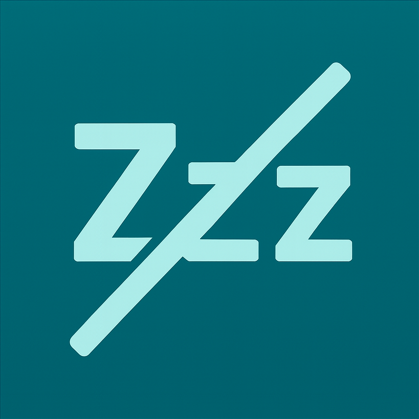

# 

# AntiAFK

## Keep Your PC Active Automatically!

**AntiAFK** is a free, open-source tool that simulates user activity by randomly switching focus between open windows. This helps prevent your status from going idle in applications like Microsoft Teams, Slack, Zoom, Discord, Skype, and other software that detects user inactivity.

### Features

*   Runs silently in the system tray
*   Randomly switches focus between open windows
*   Keeps your status active in Teams, Slack, Zoom, Discord, Skype, and more
*   Lightweight and easy to use
*   No mouse movement or fake input required

### Why Use AntiAFK?

Many collaboration and communication tools (like Teams, Slack, Zoom, Discord, Skype, Webex, Google Meet, and more) automatically set your status to "Away" or "Idle" if you don't interact with your computer for a while. AntiAFK helps you stay "Active" by simulating real user activity—no more unwanted "Away" status!

### Installation

1.  Download the latest release from the [Releases](https://github.com/themetalleg/AntiAfk/releases) page.
2.  Run `AntiAFK.exe` (no installation required).
3.  The app will appear in your system tray. You can close AntiAFK at any time by right-clicking the tray icon and selecting 'Exit'.

### Build Process & VS Code Tasks

This repository includes a pre-configured `tasks.json` for Visual Studio Code. You can build the project into a standalone Windows executable using Nuitka by running the "Compile" task. The build process automatically bundles all required dependencies and sets the tray icon.

**Build command highlights:**

*   Output file: `AntiAFK.exe`
*   Console: Disabled for a silent experience
*   Icon: Uses your custom `icon.png`
*   All dependencies are included for portability

### Script Parameters

At the top of `anti_afk.py`, you'll find constants that control the app's behavior:

*   `TRAY_ICON_NAME` and `TRAY_ICON_TITLE`: Name and tooltip for the tray icon
*   `ICON_FILE`: Path to the tray icon image
*   `WINDOW_SWITCH_INTERVAL`: Time in seconds between window switches (default: 120)
*   `EXCLUDE_TITLE`: Windows with this title are never switched to (default: "AntiAFK")

You can easily adjust these parameters to customize AntiAFK for your needs.

### ⭐ Star This Project!

If you find AntiAFK useful, please consider giving it a star on [GitHub](https://github.com/themetalleg/AntiAfk)!

### Contributing

Contributions are welcome! Feel free to open issues, submit pull requests, or suggest new features. See [CONTRIBUTING.md](CONTRIBUTING.md) for guidelines.

### License

MIT License

---

**Keywords:** anti afk, anti idle, keep active, teams status, slack status, zoom status, discord status, skype status, webex, google meet, prevent away, windows tray, open source, productivity, automation, simulate activity, stay online, github